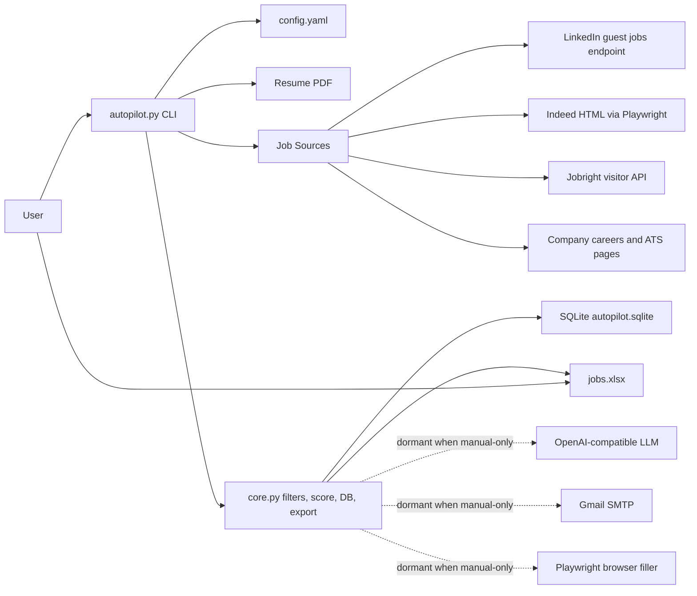
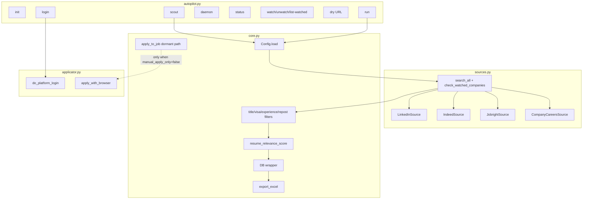
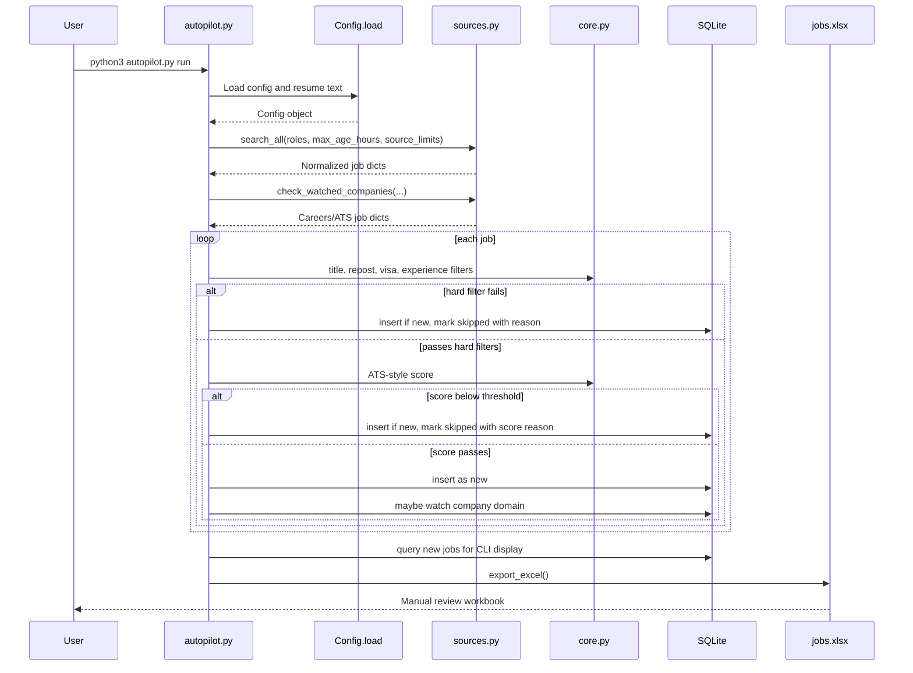
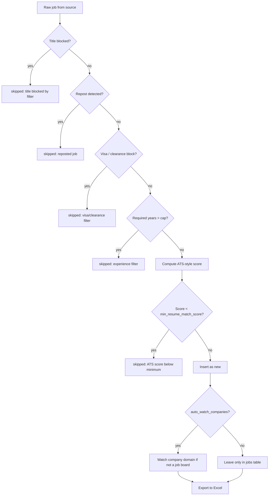
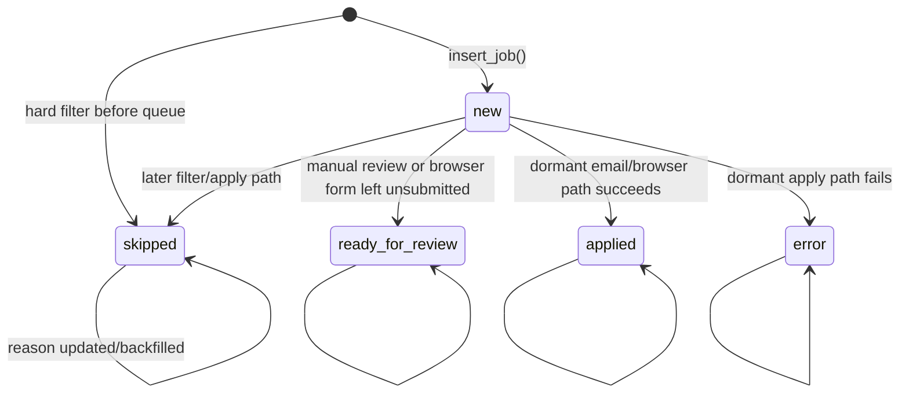
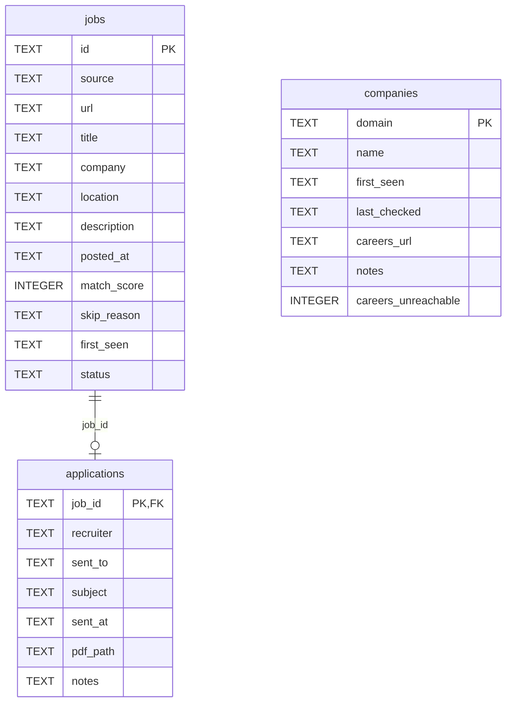
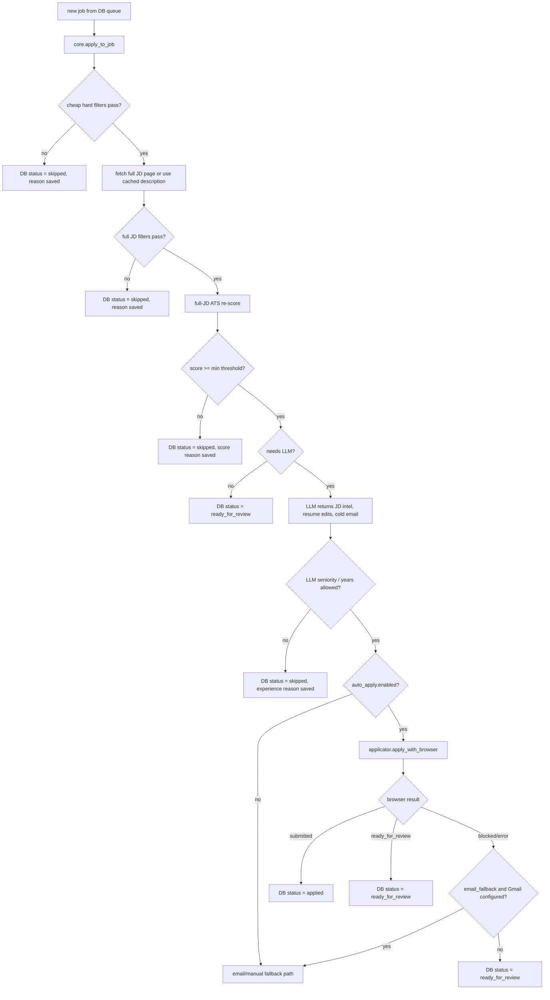
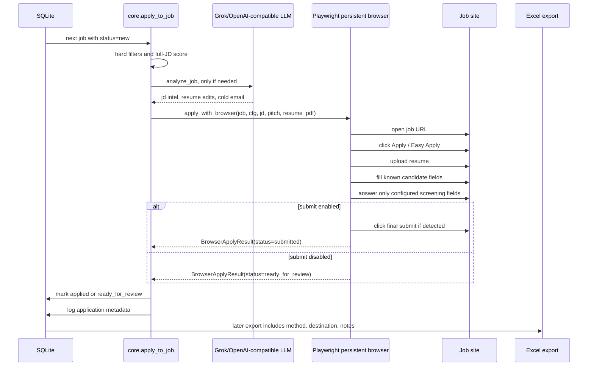
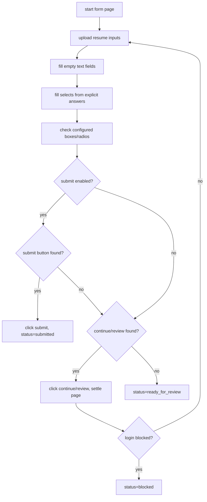

# Job Autopilot Project Deep Dive

This document describes the full local project: architecture, runtime flow, source scraping behavior, ATS-style scoring, filters, database schema, Excel output, manual-apply safety model, dormant automation paths, and operational details.

The current project is configured as a scrape-and-export job scout. It does not apply to jobs in the active default mode.

## Table Of Contents

- [Purpose](#purpose)
- [Current Operating Mode](#current-operating-mode)
- [Repository Map](#repository-map)
- [System Context Diagram](#system-context-diagram)
- [Runtime Component Diagram](#runtime-component-diagram)
- [End-To-End Flow](#end-to-end-flow)
- [CLI Commands](#cli-commands)
- [Configuration Model](#configuration-model)
- [Active Job Sources](#active-job-sources)
- [Watched Company Careers Scanner](#watched-company-careers-scanner)
- [Career URL Legitimacy And Dedupe Model](#career-url-legitimacy-and-dedupe-model)
- [Filtering Pipeline](#filtering-pipeline)
- [ATS-Style Resume Match Scoring](#ats-style-resume-match-scoring)
- [Job Status State Machine](#job-status-state-machine)
- [Database Design](#database-design)
- [Excel Export Design](#excel-export-design)
- [Manual-Apply Safety Guarantees](#manual-apply-safety-guarantees)
- [Dormant Automation Path](#dormant-automation-path)
- [Auto-Apply Model](#auto-apply-model)
- [Resume Tailoring Path](#resume-tailoring-path)
- [Email And Recruiter Discovery Path](#email-and-recruiter-discovery-path)
- [Logging And Output Files](#logging-and-output-files)
- [Runbooks](#runbooks)
- [Niche Implementation Details](#niche-implementation-details)
- [Known Constraints](#known-constraints)
- [Security Notes](#security-notes)
- [Maintenance Checklist](#maintenance-checklist)

## Purpose

Job Autopilot is a local Python agent that searches for jobs matching a configured resume and target role list, filters out poor matches, records skip reasons, and exports a reviewable Excel workbook.

The current goal is:

- Search LinkedIn, Indeed, Jobright, and watched company career/ATS pages.
- Score jobs against the resume with an ATS-inspired algorithm.
- Skip senior, visa-blocked, reposted, too-experienced, and low-match jobs.
- Record every skipped job with a `Skip Reason`.
- Export all stored jobs to `jobs.xlsx`.
- Leave application decisions to the user.

## Current Operating Mode

The active config is manual-only:

```yaml
behavior:
  manual_apply_only: true
auto_apply:
  enabled: false
  submit: false
gmail:
  send: false
```

In this mode:

- No Easy Apply is clicked.
- No company application form is filled.
- No application is submitted.
- No recruiter email is sent.
- No LLM client is initialized by `run` or `scout`.
- Jobs are scraped, filtered, scored, persisted, and exported only.

Current active search capacity:

```yaml
max_per_run: 5000
source_limits:
  linkedin_max_jobs_per_role: 1000
  indeed_max_pages_per_role: 100
  jobright_max_pages_per_role: 250
  watched_company_discovery_candidates: 8
```

`watched_company_discovery_candidates` is used only until a company has one cached canonical `careers_url`.

## Repository Map

```text
job-autopilot/
├── autopilot.py           # CLI entrypoint and orchestration
├── sources.py             # LinkedIn, Indeed, Jobright, watched careers scanners
├── core.py                # config, filters, scoring, DB, Excel, LLM/email/dormant apply pipeline
├── applicator.py          # Playwright browser filler, disabled in current manual mode
├── config.yaml            # active local config, can contain secrets, do not commit
├── config.example.yaml    # safe template config
├── README.md              # user-facing setup and usage guide
├── requirements.txt       # Python dependencies
├── autopilot.sqlite       # local SQLite state
└── logs/
    └── autopilot.log      # local runtime log
```

Output directory from config:

```text
~/Downloads/job-autopilot/
├── autopilot.sqlite
├── jobs.xlsx
├── logs/
│   └── autopilot.log
├── resumes/               # tailored PDFs only if resume tailoring is enabled
├── browser-profile/       # browser auth profile only if login/automation is used
└── applications/          # screenshots only if browser automation is used
```

## System Context Diagram



## Runtime Component Diagram



## End-To-End Flow

### Manual `run` / `scout` Flow



### Decision Tree



## CLI Commands

Implemented in `autopilot.py`.

| Command | Current behavior |
| --- | --- |
| `python3 autopilot.py init` | Copies `config.example.yaml` to `config.yaml` if missing. |
| `python3 autopilot.py scout` | Scrapes, filters, scores, prints queued jobs, exports Excel. No applications. |
| `python3 autopilot.py run` | Same scrape/export pass. In manual mode it does not initialize browser, Gmail, or LLM. |
| `python3 autopilot.py daemon` | Runs `run` once, then repeats every `schedule_minutes`. |
| `python3 autopilot.py status` | Prints DB counts and paths. |
| `python3 autopilot.py watch <domain> [name]` | Adds a company to watched careers scanning. |
| `python3 autopilot.py unwatch <domain>` | Removes a watched company. |
| `python3 autopilot.py list-watched` | Lists watched companies. |
| `python3 autopilot.py dry <url>` | Adds a manual URL to Excel. In manual mode, does not apply. |
| `python3 autopilot.py login [platform...]` | Opens browser login for LinkedIn/Indeed/Jobright. Only needed for dormant browser automation or authenticated browsing. |

## Configuration Model

`core.Config.load()` reads YAML and returns a typed dataclass.

Key config groups:

| Key | Purpose |
| --- | --- |
| `candidate` | Candidate identity used by dormant email/browser paths. |
| `resume_pdf` | Path to the one-page resume PDF. Text is extracted during config load. |
| `roles` | Search keyword/location pairs. Every role is searched across active sources. |
| `schedule_minutes` | Daemon cadence. |
| `max_per_run` | Number of `new` jobs shown in CLI queue. Excel exports all stored jobs. |
| `source_limits` | Per-source search capacity. |
| `xai` | OpenAI-compatible LLM endpoint, dormant in manual mode. |
| `gmail` | Gmail SMTP settings, dormant in manual mode. |
| `anymail_finder` | Optional recruiter-email verification, dormant in manual mode. |
| `filters` | Title blocklist, experience cap, visa/sponsorship gate. |
| `behavior` | Manual mode, score threshold, age window, auto-watch. |
| `auto_apply` | Browser automation settings, disabled in current config. |

Current role families:

- Machine Learning Engineer
- AI Engineer
- LLM Engineer
- Generative AI Engineer
- Robotics AI Engineer
- Robotics Machine Learning Engineer
- Quantitative Analyst
- Quantitative Engineer
- Quant Researcher Machine Learning
- AI Agent Engineer
- Applied AI Scientist
- Data Scientist Machine Learning
- Software Engineer Machine Learning

Current active behavior details:

```yaml
behavior:
  manual_apply_only: true
  min_resume_match_score: 70
  tailor_resume: false
  require_verified_email: false
  auto_watch_companies: true
  max_age_hours: 12
filters:
  max_years_required: 2
  block_no_sponsorship: true
```

Important: `config.yaml` can contain secrets. Do not paste or commit real API keys.

## Active Job Sources

Only these sources are active in `_configured_sources()`:

```python
["linkedin", "indeed", "jobright"]
```

Handshake, Wellfound, and Hacker News are intentionally excluded.

### LinkedInSource

Implementation: `sources.LinkedInSource`

Behavior:

- Uses LinkedIn guest endpoint:
  `https://www.linkedin.com/jobs-guest/jobs/api/seeMoreJobPostings/search`
- Query params:
  - `keywords`
  - `location`
  - `f_TPR=r<seconds>` if `max_age_hours <= 168`
  - `start=<offset>`
- Page size: `25`.
- Default cap: `1000` jobs per role.
- Sleeps randomly between `1.5` and `3.5` seconds between pages.
- Retries 429 responses using `Retry-After` when present, otherwise exponential wait.
- Stops when:
  - fetch fails,
  - page has no parseable jobs,
  - max job cap is reached.

Normalized fields:

```python
{
  "id": "linkedin:<numeric_id>",
  "source": "linkedin",
  "url": "<job view URL>",
  "title": "...",
  "company": "...",
  "location": "...",
  "description": "",
  "posted_at": "<time datetime if present>",
  "reposted": <bool>
}
```

Niche detail: LinkedIn snippets often have empty descriptions, so scoring can rely heavily on title, company, and source metadata during the scrape-only pass.

Detail enrichment: if a title-only LinkedIn row scores at least `behavior.detail_enrich_min_score`, the pipeline fetches the LinkedIn guest job posting detail endpoint before final experience and ATS score checks. This prevents promising LinkedIn rows from being skipped only because the search endpoint returned no description.

### IndeedSource

Implementation: `sources.IndeedSource`

Behavior:

- Uses Playwright because plain HTTP is commonly blocked or returns thin pages.
- URL shape:
  `https://www.indeed.com/jobs?q=<keywords>&l=<location>&fromage=<days>&start=<offset>`
- `fromage` is `max(1, max_age_hours // 24)`.
- Page size: `10`.
- Default cap: `100` pages per role.
- Each page launches Chromium through `_playwright_get()`.
- `_playwright_get()` has:
  - Playwright timeout of `timeout * 1000`.
  - SIGALRM hard timeout of `timeout + 40` seconds.
  - headless Chromium with `--no-sandbox` and `--disable-dev-shm-usage`.
- Primary parser looks for embedded JSON `"results": [...]`.
- Fallback parser scans `a[data-jk]`.

Normalized fields:

```python
{
  "id": "indeed:<jobkey>",
  "source": "indeed",
  "url": "https://www.indeed.com/viewjob?jk=<jobkey>",
  "title": "...",
  "company": "...",
  "location": "...",
  "description": "<snippet up to 2000 chars>",
  "posted_at": "<relative time converted to ISO>",
  "reposted": <bool>
}
```

Niche detail: `_relative_to_iso()` converts strings like `Just posted`, `2 hours ago`, `3 days ago`, `2 weeks ago`, and `30+ days` into approximate ISO timestamps. Unknown formats pass through and are treated as unknown age.

Detail enrichment: if a title-only Indeed row scores at least `behavior.detail_enrich_min_score`, the pipeline opens the `viewjob` page with Playwright and extracts the full job description before final experience and ATS score checks.

### JobrightSource

Implementation: `sources.JobrightSource`

Behavior:

- Uses Jobright's public visitor search API.
- API URL:
  `https://jobright.ai/swan/recommend/visitor-search`
- Query params include:
  - `lite=false`
  - `count=20`
  - `position=<page * 20>`
  - `searchType=job_title`
  - `sortCondition=RECOMMENDED`
- Payload includes:
  - `jobTaxonomyList: [{"taxonomyId": "00-00-00", "title": keywords}]`
  - `country: US`
  - empty locations/companies/seniority/workModel filters
  - `daysAgo: "1"` if `max_age_hours <= 24`
- Page size: `20`.
- Default cap: `250` pages per role, about `5000` jobs.
- Stops when:
  - API returns no items,
  - a page is shorter than `PAGE_SIZE`,
  - `position + len(items) >= totalJobs`,
  - all item IDs on a page were already seen,
  - API fails after page 1.
- If page 1 API fails, falls back to parsing the Next.js `__NEXT_DATA__` HTML payload.

Normalized fields:

```python
{
  "id": "jobright:<jobId>",
  "source": "jobright",
  "url": "https://jobright.ai/jobs/info/<jobId>",
  "title": "...",
  "company": "...",
  "location": "...",
  "description": "<NLP title + employment type + work model + seniority + summary + requirements + recommendation tags + years>",
  "posted_at": "<ISO publish time>"
}
```

Niche detail: Jobright descriptions are richer than LinkedIn guest results because the code includes `jobSummary`, `requirements`, `recommendationTags`, and `min_required_years`. This improves early filtering for visa tags such as `No H1B` and experience requirements.

## Watched Company Careers Scanner

Implementation: `sources.CompanyCareersSource`

Watched companies are stored in the `companies` table. Companies are auto-watched when a job passes all hard filters and score threshold and its company domain is not a known job board/ATS domain.

Candidate career paths:

```python
CAREERS_PATHS = [
  "/careers",
  "/jobs",
]
```

ATS templates:

```python
ATS_TEMPLATES = [
  "https://boards.greenhouse.io/{slug}",
  "https://jobs.lever.co/{slug}",
  "https://apply.workable.com/{slug}",
  "https://{slug}.bamboohr.com/jobs",
]
```

Behavior:

- Uses `companies.careers_url` when present, so future runs scan one URL only.
- If no URL is cached, checks a short prioritized discovery list: Greenhouse, Lever, Workable, BambooHR, then `/careers` and `/jobs` on the company's own domain.
- Caches the first trusted URL that returns jobs, or the first trusted reachable URL if no jobs are found.
- Rejects invalid watched domains such as raw company-region labels that are not real domains.
- Rejects candidate URLs outside the company's domain or known ATS host allowlist.
- Marks a company as `careers_unreachable=1` if no candidate URL is reachable.
- Skips previously unreachable companies on future runs.
- Clears `careers_unreachable` when a page becomes reachable.
- Normalizes job URLs before dedupe by removing query strings, fragments, duplicate slashes, and trailing slashes.
- Extracts links whose href contains job-like path fragments:
  `job`, `jobs`, `career`, `careers`, `position`, `opening`, `role`, `listing`, `posting`.
- Filters extracted jobs by role keyword tokens.

Niche detail: The scanner now trades exhaustive crawling for reliability. Discovery is short and one-time; after `careers_url` is cached, each company gets exactly one careers/ATS request per run.

## Career URL Legitimacy And Dedupe Model

The watched-company scanner now validates a careers URL before it can be used or cached.

Legitimacy checks:

- The watched company key must be a real domain shape, for example `postman.com`. Raw labels such as `unity south apac (sea, anz, ind subcont.)` are rejected.
- Official company careers pages are trusted only when the host is the company domain or a subdomain of it.
- External ATS pages are trusted only on an allowlist:
  - `boards.greenhouse.io`
  - `jobs.lever.co`
  - `apply.workable.com`
  - `*.bamboohr.com/jobs`
- Discovery tries trusted ATS boards before generic company pages, because ATS boards are usually canonical and less duplicated.
- If a valid `companies.careers_url` already exists, discovery is skipped and only that URL is scanned.
- Untrusted candidates are logged at debug level and ignored.

Duplicate prevention:

- The scanner chooses one canonical source URL per company and saves it in `companies.careers_url`.
- Job URLs are canonicalized by forcing HTTPS, lowercasing the host, removing fragments/tracking parameters, collapsing duplicate slashes, and removing trailing slashes while preserving meaningful job-ID query parameters.
- Duplicate job links on the same page are deduped before returning jobs.
- Database insertion still uses `INSERT OR IGNORE` on `jobs.id`, so already-seen jobs are not duplicated.

This does not prove a company is legitimate in the legal/compliance sense. It is a practical anti-spam and anti-duplicate check for this local scout: only official company domains and major ATS hosts are accepted, and each watched company gets one cached source of truth.

## Filtering Pipeline

Filters run before a job is inserted as `new`.

### Title Blocklist

Configured under:

```yaml
filters:
  block_title_keywords:
```

Current blocked families include:

- Seniority: `senior`, `sr.`, `staff`, `principal`, `lead`, `head of`, `director`, `manager`, `vp`, `architect`.
- Levels: `ii`, `iii`, `iv`, `level 2`, `level 3`.
- Excluded role families: `ai content writer`, `content writer`, `business analyst`, `ai operations specialist`, `operations specialist`, `remote software engineer`.

Implementation detail:

- The title is lowercased and padded with spaces.
- Matching is case-insensitive substring matching.
- Skip reason format:
  `title blocked by filter: <title>`

### Repost Filter

Triggers if:

- Source sets `reposted: true`, or
- `repost` appears in title + description.

Skip reason:

```text
reposted job
```

### Visa / Clearance Filter

Enabled by:

```yaml
filters:
  block_no_sponsorship: true
```

Regex catches examples such as:

- `security clearance`
- `top secret`
- `TS/SCI`
- `no visa sponsorship`
- `will not sponsor`
- `no H1B`
- `H1B not sponsored`
- `US citizens only`
- `must be a US citizen`
- `authorized to work ... without sponsorship`
- `green card or US citizen only`

Skip reason format:

```text
visa/clearance filter: '<matched text>'
```

### Experience Filter

Configured by:

```yaml
filters:
  max_years_required: 2
```

With `2`, it blocks `3`, `3+`, `4`, `4+`, `5-7`, etc.

Regex families:

- Range: `3-5 years`, `5 to 7 years`
- Plus: `3+ years`
- Minimum: `minimum 3 years`, `minimum of 8 years`, `at least 4 years`, `must have 5 years`
- Plain: `4 years of experience`
- Word-number years: `eight years`, `five plus years`, `eight to ten years`
- Suffix minimum: `8 years minimum`, `8 years or more`

Important nuance:

- Ranges use the lower bound. `0-2` passes. `1-3` passes because the required minimum is 1.
- Preferred-only context can pass if the nearby text says `preferred`, `nice to have`, `bonus`, or `plus` and does not also look like a hard requirement.
- Explicit plus forms such as `3+ years` and `8 plus years` are treated as hard blocks even if the surrounding text is sparse.

Skip reason format:

```text
experience filter: requires <n>+ years over cap <cap>
```

After the stricter parser was added, the current DB was reprocessed and no `new` or `ready_for_review` rows still matched the experience gate.

### Low ATS Score Filter

Configured by:

```yaml
behavior:
  min_resume_match_score: 70
```

Skip reason format:

```text
ATS score <score> below minimum <threshold>
```

## ATS-Style Resume Match Scoring

Implemented in:

- `resume_relevance_score()`
- `resume_relevance_breakdown()`

The score is ATS-inspired, not a reverse-engineered copy of Workday, Greenhouse, or any proprietary ATS.

### Score Formula

```text
raw_score =
  0.25 * target_role_scorecard_component
+ 0.25 * resume_skill_evidence_component
+ 0.20 * semantic_concept_vector_component
+ 0.15 * ontology_graph_component
+ 0.10 * technical_overlap_component
+ 0.05 * exact_title_bonus_component

score = round(100 * capped(raw_score))
```

Point breakdown exposed by `resume_relevance_breakdown()`:

| Component | Max points | Meaning |
| --- | ---: | --- |
| `scorecard_points` | 25 | Best configured role match against job title/description. |
| `resume_skill_points` | 25 | Weighted resume skill hits in title/description. |
| `semantic_points` | 20 | Dense-ish concept-vector cosine similarity. |
| `ontology_points` | 15 | Skills-cloud / ontology concept coverage. |
| `technical_overlap_points` | 10 | Technical terms from job that are also in resume. |
| `title_bonus_points` | 5 | Exact configured role phrase appears in title. |

### Match Tiers

| Score | Tier |
| ---: | --- |
| `>= 75` | `strong` |
| `>= 55` | `review` |
| `>= 35` | `weak_review` |
| `< 35` | `reject` |

Current config requires `70`, so many `review` and all `weak_review` jobs are skipped.

### Resume Skill Weights

The direct resume-skill scorer uses `_RESUME_SKILL_WEIGHTS`.

Weight 5 examples:

- `rag`
- `llm`
- `langchain`
- `agentic`
- `rlhf`
- `transformers`
- `pytorch`
- `qlora`
- `lora`
- `pgvector`
- `knowledge graph`
- `hugging face`
- `fine-tuning`
- `llama`
- `gpt-4`
- `generative ai`

Weight 3 examples:

- `tensorflow`
- `xgboost`
- `scikit-learn`
- `bayesian`
- `fastapi`
- `docker`
- `kubernetes`
- `aws`
- `postgresql`
- `nlp`
- `embeddings`
- `mlops`
- `robotics`
- `autonomous`
- `perception`
- `controls`
- `optimization`
- `quantitative`
- `quant`
- `stochastic`
- `time series`

Weight 1-2 examples:

- `ai`
- `ml`
- `python`
- `sql`
- `git`
- `github actions`
- `ci/cd`
- `agents`
- `inference`
- `model deployment`
- `s3`
- `lambda`
- `data pipeline`

Niche detail: Title hits count `1.5x` in `_skill_hit_score()` because titles are always present while descriptions are often missing or thin.

### Concept Graph

`_ATS_CONCEPT_GRAPH` groups terms into concepts:

- `ai_core`
- `llm_generative`
- `ml_modeling`
- `data_science`
- `robotics_ai`
- `quant_finance`
- `engineering_platform`

The concept vector is built by:

1. Tokenizing text.
2. Removing stopwords.
3. Weighting known tech terms `3x`.
4. Adding bigrams with weight `2`.
5. Expanding synonyms.
6. Summing weights per concept.

Synonym examples:

| Phrase | Expanded concepts/terms |
| --- | --- |
| `retrieval augmented generation` | `rag` |
| `large language model` | `llm` |
| `natural language processing` | `nlp` |
| `computer vision` | `vision`, `perception` |
| `autonomous vehicles` | `autonomous`, `robotics` |
| `quant researcher` | `quant`, `researcher` |
| `time series` | `time-series`, `timeseries` |

### Score Caps

Caps prevent random or vague jobs from scoring high.

Cap 1:

```text
if no AI/ML/robotics/quant intent:
  raw = min(raw * 0.45, 0.28)
```

Cap 2:

```text
if skill_score < 0.10 and role_component < 0.70:
  raw = min(raw, 0.34)
```

Cap 3:

```text
if title is non-technical AI-adjacent:
  raw = min(raw, 0.34)
```

Non-technical AI-adjacent examples:

- content
- writer
- copywriter
- marketing
- sales
- business analyst
- operations specialist
- customer support
- account executive
- product owner
- program manager
- project manager

## Job Status State Machine



Current manual flow mostly produces:

- `new` for jobs that pass filters and score threshold.
- `skipped` for filtered jobs with `skip_reason`.

## Database Design

SQLite path:

```text
~/Downloads/job-autopilot/autopilot.sqlite
```

The DB wrapper is `core.DB`.

### ER Diagram



### jobs Table

| Column | Meaning |
| --- | --- |
| `id` | Source-specific unique ID such as `linkedin:<id>`, `indeed:<jk>`, `jobright:<jobId>`, or `careers:<url>`. |
| `source` | Source name. Active direct sources are `linkedin`, `indeed`, `jobright`; watched company source is `careers`. |
| `url` | Apply/review URL. |
| `title` | Job title. |
| `company` | Company name. |
| `location` | Job location when available. |
| `description` | Cached snippet, capped to 8000 chars at insert. |
| `posted_at` | Source-provided or inferred timestamp. |
| `match_score` | ATS-style score, 0-100. |
| `skip_reason` | Human-readable reason for skipped jobs. |
| `first_seen` | UTC ISO timestamp when inserted. |
| `status` | `new`, `skipped`, `ready_for_review`, `applied`, or `error`. |

### companies Table

| Column | Meaning |
| --- | --- |
| `domain` | Company domain key, generated by `slug_domain()`. |
| `name` | Company display name. |
| `first_seen` | UTC ISO timestamp. |
| `last_checked` | Last careers scanner check. |
| `careers_url` | Optional stored careers URL. |
| `notes` | Freeform notes, currently unused by primary flow. |
| `careers_unreachable` | `1` means skip careers scan until manually reset/cleared by a reachable check. |

### applications Table

Dormant in current manual mode. Used by browser/email apply paths.

| Column | Meaning |
| --- | --- |
| `job_id` | FK to `jobs.id`. |
| `recruiter` | Extracted recruiter name. |
| `sent_to` | Email recipient or browser destination. |
| `subject` | Email subject or browser method/status string. |
| `sent_at` | UTC ISO timestamp. |
| `pdf_path` | Original or tailored resume path. |
| `notes` | Apply method details, screenshots, candidate emails, etc. |

### Migration Behavior

`DB._ensure_columns()` adds missing columns for older DB files:

- `jobs.match_score`
- `jobs.skip_reason`
- `companies.careers_unreachable`

This lets old SQLite files survive code updates without manual migrations.

## Excel Export Design

Output:

```text
~/Downloads/job-autopilot/jobs.xlsx
```

Implementation: `DB.export_excel()`.

Workbook structure:

- `Summary` sheet.
- One sheet per `first_seen` date, named `YYYY-MM-DD`.

### Summary Sheet

Top tiles:

- Total Found
- Applied
- Ready for Review
- New
- Skipped
- Error

Daily table:

- Date
- Total Found
- Applied
- Ready for Review
- New
- Skipped
- Error

### Daily Sheets

Columns:

| Column | Meaning |
| --- | --- |
| `Status` | Job status. |
| `Match %` | ATS-style score. |
| `Title` | Job title. |
| `Company` | Company name. |
| `Location` | Location. |
| `Source` | Source name. |
| `Posted At` | Source-posted timestamp. |
| `Found At` | First-seen timestamp. |
| `Apply URL` | Clickable review/apply URL. |
| `Skip Reason` | Exact skip reason for skipped jobs. |
| `Sent To` | Dormant email/browser apply result. |
| `Applied At` | Dormant application timestamp. |
| `Method` | Dormant email/browser method. |
| `Recruiter` | Dormant recruiter field. |
| `Notes` | Dormant application notes. |

Rows are sorted by:

1. Status order:
   - `applied`
   - `ready_for_review`
   - `new`
   - `skipped`
   - `error`
2. Descending `match_score`.

Status colors:

| Status | Fill |
| --- | --- |
| `applied` | green |
| `ready_for_review` | yellow |
| `new` | blue |
| `skipped` | gray |
| `error` | red |

Niche detail: `Apply URL` is hyperlinked only when a URL value is present.

## Manual-Apply Safety Guarantees

The current code path enforces manual-only mode in `cmd_run()`:

```python
if _manual_apply_only(cfg):
    print("Scrape-only mode is enabled...")
    _export_excel(cfg, db)
    return 0
```

Because of that early return:

- `_clients()` is not called.
- `Grok` is not created.
- `Gmailer` is not created.
- `core.apply_to_job()` is not called.
- `applicator.apply_with_browser()` is not imported or called.
- No browser automation runs.
- No Gmail SMTP action runs.

`cmd_scout()` is always scrape/rank/export only.

`cmd_dry()` in manual mode inserts the URL and exports Excel without applying.

## Dormant Automation Path

Automation exists but is disabled by active config.

Relevant config:

```yaml
auto_apply:
  enabled: false
  submit: false
```

If manual-only were turned off and `auto_apply.enabled` were true, `core.apply_to_job()` could call `applicator.apply_with_browser()`.

Browser automation behavior:

- Uses Playwright persistent Chromium profile.
- Opens the job URL.
- Clicks apply/easy apply buttons by accessible role and text regex.
- Fills known fields:
  - first name
  - last name
  - full name
  - email
  - phone
  - LinkedIn
  - cover letter/message
- Uploads the resume to file inputs.
- Fills selects/checks boxes only from explicit `auto_apply.answers`.
- Stops before final submit unless `auto_apply.submit: true`.
- Takes a screenshot into `applications/`.

Niche detail: It detects login-blocked pages by URL tokens like `/login`, `/signin`, `/auth`, or page title text like `sign in`, `log in`, `login required`.

## Auto-Apply Model

This section documents the auto-apply design as implemented in `core.py` and `applicator.py`.

Current status: disabled. The active project uses manual review only.

### Activation Gates

Auto-apply requires all of these conditions to be intentionally changed:

```yaml
behavior:
  manual_apply_only: false
auto_apply:
  enabled: true
```

Final submission requires an additional explicit switch:

```yaml
auto_apply:
  submit: true
```

Without `submit: true`, the browser model fills what it can and stops with the form ready for human review.

### Auto-Apply Control Flow



Important nuance: browser auto-apply is downstream of the same filters used by manual mode. It does not bypass title, repost, visa, experience, or match-score checks.

### Auto-Apply Sequence



### Auto-Apply Data Model

Input objects:

| Object | Source | Purpose |
| --- | --- | --- |
| `job` | `jobs` table row | URL, title, company, source, cached description, score. |
| `cfg` | `Config.load()` | Candidate data, browser settings, resume path, safety flags. |
| `jd` | LLM result | Company, title, domain, seniority, required years, summary. |
| `pitch` | LLM result | Cover-letter-style message used for message/cover fields. |
| `resume_pdf` | Original or tailored PDF path | Uploaded to file inputs. |

Browser result dataclass:

```python
@dataclass
class BrowserApplyResult:
    status: str
    method: str = "browser"
    destination: str = ""
    screenshot_path: str = ""
    note: str = ""
```

Result statuses:

| Browser status | Meaning | DB status |
| --- | --- | --- |
| `submitted` | Final submit button was clicked. Only possible with `auto_apply.submit: true`. | `applied` |
| `ready_for_review` | Form was filled where possible and left for user review. | `ready_for_review` |
| `blocked` | Login or auth wall detected. | Usually `ready_for_review`, unless email fallback succeeds. |
| `error` | Browser timeout or automation exception. | Usually `ready_for_review` or `error`, depending on caller path. |

### Browser Method Selection

Method starts as:

```python
method = "easy_apply" if job.get("source") == "linkedin" else "company_site"
```

Then it may change based on the clicked button text:

- If the clicked apply button contains `easy apply`, method is `easy_apply`.
- Otherwise it stays `company_site` or `browser`.

The apply button text regex:

```text
easy apply
apply now
apply on employer site
apply for this job
apply
```

The continue button text regex:

```text
next
continue
save and continue
review
```

The submit button text regex:

```text
submit application
submit
send application
complete application
```

### Field Fill Model

`_candidate_values()` derives common values from config:

| Label key | Value |
| --- | --- |
| `first name`, `firstname`, `given name` | First token of candidate name. |
| `last name`, `lastname`, `family name` | Last token of candidate name. |
| `full name`, `name` | Candidate full name. |
| `email`, `e-mail` | Candidate email. |
| `phone`, `mobile` | Candidate phone. |
| `linkedin`, `linked in` | Candidate LinkedIn URL. |
| `cover letter`, `message`, `why are you interested` | Generated pitch plus signature. |

Field label extraction uses DOM context:

- input `name`
- input `id`
- placeholder
- `aria-label`
- autocomplete
- type
- associated `label[for=id]`
- parent `<label>`
- nearest form group/question container text

The filler only fills empty text inputs and textareas. It skips:

- hidden inputs
- file inputs
- submit buttons
- disabled fields
- already-filled fields
- checkbox/radio fields unless explicitly configured

### Screening Answer Model

Custom screening answers come only from:

```yaml
auto_apply:
  answers:
    "<label keyword>": "<truthful answer>"
```

Matching is substring-based against the lowercase field label/context.

Examples:

```yaml
auto_apply:
  answers:
    "authorized to work": "Yes"
    "require sponsorship": "Yes"
    "willing to relocate": "No"
    "gpa": "3.8"
```

Important safety behavior:

- The browser filler does not invent screening answers.
- Select boxes are filled only if a configured answer matches the field label.
- Checkboxes/radio buttons are checked only when the configured answer is truthy:
  `1`, `true`, `yes`, `y`, `checked`, or `check`.
- `_answer_for()` avoids using the generic `name` key for company, employer, school, university, or reference fields.

### File Upload Model

`_fill_files()` scans:

```css
input[type='file']
```

For each file input, it attempts:

```python
inp.set_input_files(str(resume_pdf))
```

It does not inspect whether the field expects a resume, cover letter, transcript, or other document. This is why manual review before submit is the default.

### Step Loop Model

The browser loop runs up to:

```yaml
auto_apply:
  max_steps: 5
```

Each step:

1. Upload resume to file inputs.
2. Fill text fields from candidate/pitch values.
3. Fill selects from explicit answers.
4. Check boxes/radios from explicit truthy answers.
5. If `submit: true`, try submit button.
6. Otherwise try continue/review button.
7. Stop when no continue/review action is found.
8. Stop if login/auth wall appears.



### Screenshot And Audit Trail

Every browser result attempts to save a screenshot:

```text
~/Downloads/job-autopilot/applications/<timestamp>-<job-id>-<status>.png
```

The application log notes can include:

- resume mode: original or tailored
- screenshot path
- browser result note
- destination URL
- method and status

These appear in `applications` and then in Excel columns such as `Method`, `Sent To`, `Applied At`, and `Notes`.

### Login Session Model

`python3 autopilot.py login` uses `do_platform_login()` to open a persistent Chromium profile.

Supported login targets:

- `linkedin`
- `indeed`
- `jobright`

Login URLs:

| Platform | URL |
| --- | --- |
| LinkedIn | `https://www.linkedin.com/login` |
| Indeed | `https://secure.indeed.com/account/login` |
| Jobright | `https://jobright.ai/login` |

The session is saved in:

```text
~/Downloads/job-autopilot/browser-profile/
```

Niche detail: the login helper attempts to pre-fill the candidate email on known login forms, then waits for the user to finish login and press Enter.

### Auto-Apply Safety Model

The safety model has four layers:

1. Manual-only global gate:
   `behavior.manual_apply_only: true` prevents the apply pipeline from running at all.
2. Browser feature gate:
   `auto_apply.enabled: false` prevents browser automation even if manual-only were disabled.
3. Submit gate:
   `auto_apply.submit: false` leaves forms ready for review instead of submitting.
4. Screening answer gate:
   custom questions are answered only from explicit `auto_apply.answers`.

Recommended safe experimental settings, if testing the model later:

```yaml
behavior:
  manual_apply_only: false
auto_apply:
  enabled: true
  submit: false
  email_fallback: false
```

That configuration would let the browser open and fill what it can, then stop for review without submitting or emailing.

## Resume Tailoring Path

Dormant in current config:

```yaml
behavior:
  tailor_resume: false
```

If enabled:

1. `extract_resume_lines()` reads the PDF with PyMuPDF.
2. It extracts editable line spans with bounding boxes and max char limits.
3. The LLM receives selected line payloads.
4. The LLM returns only line edits.
5. `apply_resume_edits()` redacts old text areas and inserts new text into the same bounding boxes.
6. The output PDF is saved under:
   `~/Downloads/job-autopilot/resumes/`

Hard constraints in the prompt:

- Never edit names, emails, phone numbers, URLs, dates, company names, school names, or section headers.
- Never exceed each line's `max_chars`.
- Never fabricate skills, credentials, employers, or dates.
- Keep the layout one page.

Niche detail: `apply_resume_edits()` deletes extra pages if the PDF somehow grows beyond one page.

## Email And Recruiter Discovery Path

Dormant in current manual mode.

Email generation happens through one combined LLM call:

- JD intel extraction.
- Resume edit suggestions.
- Cold email draft.

Recruiter/email helpers:

- `slug_domain()`
- `candidate_emails()`
- `anymail_finder_lookup()`
- `Gmailer.send()`

Email candidate generation:

- Uses published `careersEmail` if present.
- If recruiter full name and domain exist:
  - `first.last@domain`
  - `firstlast@domain`
  - `flast@domain`
  - `first@domain`
- Adds generic inboxes:
  - `careers@domain`
  - `jobs@domain`
  - `hiring@domain`
  - `talent@domain`
  - `recruiting@domain`
  - `people@domain`

Niche guardrail:

- `extract_resume_numbers()` extracts numeric claims from the resume.
- `disallowed_pitch_numbers()` blocks generated email text containing numeric values not present in the resume.
- If the LLM invents or changes a number, the job is skipped rather than emailed.

## Logging And Output Files

Logging setup:

```python
logging.basicConfig(
  level=logging.DEBUG if verbose else logging.INFO,
  handlers=[
    logging.StreamHandler(),
    logging.FileHandler(output_dir / "logs" / "autopilot.log"),
  ],
)
```

Primary local outputs:

| File | Purpose |
| --- | --- |
| `~/Downloads/job-autopilot/autopilot.sqlite` | Persistent state. |
| `~/Downloads/job-autopilot/jobs.xlsx` | Manual review workbook. |
| `~/Downloads/job-autopilot/logs/autopilot.log` | Runtime logs. |
| `~/Downloads/job-autopilot/resumes/*.pdf` | Tailored resumes, only if enabled. |
| `~/Downloads/job-autopilot/applications/*.png` | Browser screenshots, only if enabled. |
| `~/Downloads/job-autopilot/browser-profile/` | Persistent Chromium profile, only if login/browser path used. |

## Runbooks

### One Manual Scrape

```bash
cd /Users/aj/Library/CloudStorage/OneDrive-UW-Madison/job-autopilot
python3 autopilot.py run
```

Expected:

- Scrapes active sources.
- Filters and scores jobs.
- Prints ready-for-review jobs.
- Updates Excel.
- Does not apply.

### Scout Without Applying

```bash
python3 autopilot.py scout
```

Equivalent safety posture to `run` in manual mode.

### Check Status

```bash
python3 autopilot.py status
```

Prints counts for:

- total jobs
- new
- applied
- ready review
- skipped
- error
- watched companies
- resume PDF path
- output dir

### Add Watched Company

```bash
python3 autopilot.py watch stripe.com Stripe
```

### Remove Watched Company

```bash
python3 autopilot.py unwatch stripe.com
```

### Add A Single URL To Excel

```bash
python3 autopilot.py dry "https://example.com/job/123"
```

In manual mode this only inserts a row and exports Excel.

### Run Daemon

```bash
python3 autopilot.py daemon
```

Runs once immediately, then repeats every `schedule_minutes`.

## Niche Implementation Details

### Deduplication

Direct-source deduplication happens in two layers:

1. Per-source in-memory seen sets:
   - LinkedIn: numeric job ID or URL.
   - Indeed: `jobkey`.
   - Jobright: `jobId`.
   - Careers: full URL.
2. Aggregator dict keyed by normalized `job["id"]`.

Database insertion uses:

```sql
INSERT OR IGNORE INTO jobs ...
```

So existing rows are not duplicated.

### Age Filtering

Age is checked in source-specific ways and again in `search_all()`.

If `posted_at` is empty or unparsable:

- `_within_age()` returns `True`.
- The job is not rejected solely because age is unknown.

### Keyword Gate In Aggregator

For each configured role:

```python
kw_terms = [t for t in keywords.lower().split() if len(t) > 2]
```

A source job must contain at least one keyword token in:

```text
title + description + company
```

This is a cheap source-level relevance gate before the ATS score.

### Company Auto-Watch

Company is watched only when:

- job passes all filters,
- job passes score threshold,
- `auto_watch_companies` is true,
- company string is present,
- generated domain is not a known board/ATS domain.

Known board domains include:

- `linkedin.com`
- `indeed.com`
- `jobright.ai`
- `greenhouse.io`
- `lever.co`
- `workable.com`
- `bamboohr.com`
- `glassdoor.com`
- `ziprecruiter.com`
- `monster.com`
- `simplyhired.com`
- `dice.com`
- `builtinnyc.com`
- `builtin.com`
- `angel.co`

### Domain Slugging

`slug_domain()` behavior:

- If input looks like a URL/domain, strips scheme/path/www and returns the domain.
- If input is a company name, removes non-alphanumeric chars and appends `.com`.

Example:

```text
"Acme AI, Inc." -> "acmeaiinc.com"
```

This is intentionally simple and can be wrong for some companies.

### Skip Reason Persistence

`DB.mark(job_id, "skipped", reason)` writes both:

- `status = "skipped"`
- `skip_reason = reason`

If a skipped row is marked skipped without a reason, the existing reason is preserved.

If a non-skipped status is set without a reason, `skip_reason` is cleared.

### Historical Skip Reasons

Older skipped rows from before reason tracking may be backfilled as:

```text
historical skipped before reason tracking
```

That means the original decision was not logged at the time and no deterministic current filter matched.

### `max_per_run` Naming

In current manual mode, `max_per_run` limits the number of `new` jobs shown in the CLI queue.

It does not limit Excel export. Excel exports all rows in the database.

### Requirements Detail

Active runtime dependencies include:

- `requests`
- `beautifulsoup4`
- `lxml`
- `PyYAML`
- `schedule`
- `pypdf`
- `pymupdf`
- `playwright`
- `openpyxl`

`feedparser` remains in `requirements.txt` as a legacy dependency from removed Wellfound/HN RSS sources. It is no longer used by active code after excluding those sources.

## Known Constraints

### Source Reliability

Job boards can rate-limit, block, change HTML, or return partial data.

Expected fragile areas:

- LinkedIn guest endpoint can return 429 or empty pages.
- Indeed can block or change embedded JSON layout.
- Jobright visitor API can change payload names.
- Career pages vary widely and can require JavaScript beyond simple HTML fetch.

### Scoring Limits

The scorer is transparent and deterministic, but it is not an actual Workday or Greenhouse implementation.

Known scoring tradeoffs:

- Title-only jobs can under-score because descriptions are missing.
- Keyword-heavy but shallow postings can over-score unless caps catch them.
- Domain-specific quant/robotics roles may need more ontology terms over time.
- Current `min_resume_match_score: 70` is strict; it will skip many reviewable but weaker matches.

### Experience Filter Limits

The experience filter is regex-based.

It handles many common phrasings but can miss unusual wording such as:

- `several years`
- `demonstrated industry experience`
- `seasoned professional`
- image-only job descriptions

### Careers Scanner Limits

The watched company scanner is link-based.

It can miss:

- job cards rendered only after JavaScript,
- API-backed career sites with no static links,
- company slugs that do not match Greenhouse/Lever/Workable/BambooHR board names,
- jobs hidden behind search widgets.

## Security Notes

Do not commit:

- `config.yaml`
- real API keys
- Gmail app passwords
- browser profile folders
- local logs with sensitive URLs
- generated resumes
- application screenshots
- SQLite state if it contains private history

The active `config.yaml` can contain a real LLM API key. Documentation should describe the key name but never paste the value.

Recommended `.gitignore` additions if this repo is committed:

```gitignore
config.yaml
*.sqlite
logs/
__pycache__/
*.pyc
jobs.xlsx
browser-profile/
applications/
resumes/
```

## Maintenance Checklist

Before changing scraping behavior:

- Run `python3 -m py_compile autopilot.py core.py sources.py applicator.py`.
- Run `python3 - <<'PY'` source check:

```python
import sources
print([src.name for src in sources._configured_sources({})])
```

Expected active direct sources:

```text
['linkedin', 'indeed', 'jobright']
```

Before changing filters:

- Confirm skip reasons remain populated for every skipped job.
- Query:

```sql
SELECT COUNT(*)
FROM jobs
WHERE status='skipped'
  AND (skip_reason IS NULL OR trim(skip_reason) = '');
```

Expected:

```text
0
```

Before changing scoring:

- Keep `resume_relevance_breakdown()` transparent.
- Preserve component point outputs.
- Keep caps for wrong-family and vague roles.
- Test representative roles:
  - Robotics AI Engineer
  - Quantitative Analyst
  - Quantitative Engineer
  - LLM Engineer
  - Generic Software Engineer
  - Business Analyst
  - AI Content Writer

Before enabling any automation:

- Confirm `behavior.manual_apply_only: false` is intentional.
- Confirm `auto_apply.enabled` is intentional.
- Keep `auto_apply.submit: false` unless the user explicitly wants submission.
- Run `python3 autopilot.py login linkedin indeed jobright` only if browser auth is needed.
- Review `auto_apply.answers` for truthful screening answers.
- Confirm Gmail credentials are intentionally configured before email fallback.

## Quick Mental Model

```text
roles + resume + config
        |
        v
LinkedIn / Indeed / Jobright / watched careers
        |
        v
normalize jobs -> dedupe -> age gate -> keyword gate
        |
        v
title / repost / visa / experience filters
        |
        v
ATS-style score
        |
        +--> skipped with exact reason
        |
        +--> new, maybe auto-watch company
        |
        v
SQLite -> jobs.xlsx -> manual application by user
```
